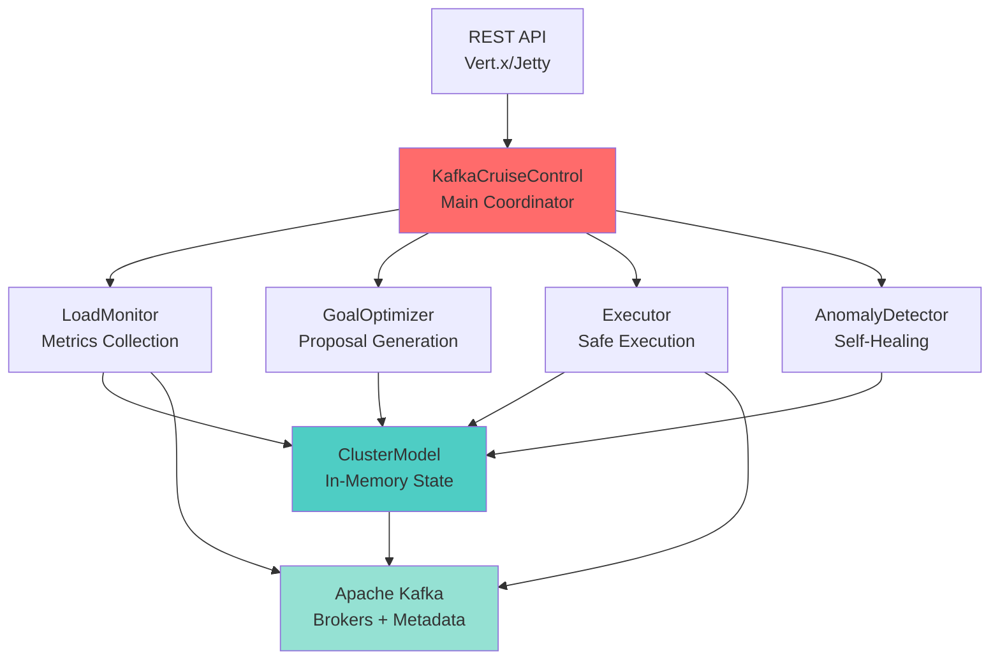
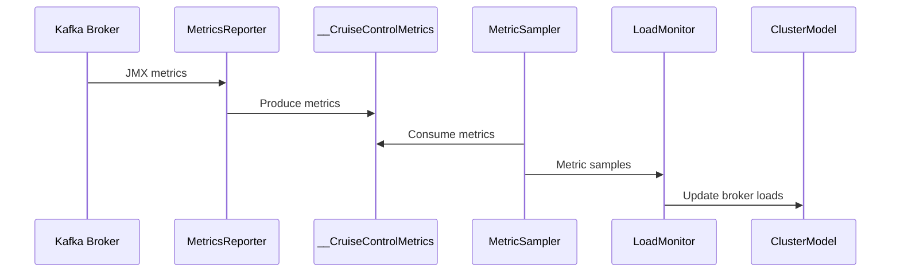
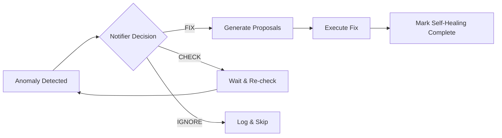

# Understanding Cruise Control: Architecture and Core Concepts

**Part 1 of 6** in the Cruise Control Deep Dive Series

**Reading Time:** ~10 minutes
**Analysis Basis:** Commit [`e30eaf3`](https://github.com/linkedin/cruise-control/commit/e30eaf352c31511241f4dfae457fbcb77022a9c6)

## What You'll Learn

- Why Cruise Control exists and what problems it solves
- The five core components and how they work together
- The ClusterModel abstraction—the heart of Cruise Control
- How data flows from Kafka brokers to optimization decisions
- Key architectural trade-offs and design decisions

## The Problem: Managing Kafka at LinkedIn Scale

Imagine you're running a Kafka cluster with 10,000 brokers. Every day, multiple brokers fail. New topics are created. Traffic patterns shift. Your cluster slowly drifts from an optimal state—some brokers are overloaded while others sit idle. Rebalancing manually is a nightmare.

This is the reality LinkedIn faced, and it's why they built Cruise Control.

> "At LinkedIn, we have 10K+ Kafka brokers, which means broker deaths are an almost daily occurrence and balancing the workload of Kafka also becomes a big overhead."
> — From the [Cruise Control README](https://github.com/linkedin/cruise-control/blob/e30eaf352c31511241f4dfae457fbcb77022a9c6/README.md#L9-L11)

Cruise Control is **not** a tool for small Kafka deployments. It's enterprise-grade infrastructure for managing Kafka at scale. Let's explore how it works.

## High-Level Architecture

Cruise Control is built around five core components that work in concert:



### The Five Core Components

Let's explore each component and understand its responsibility.

## 1. LoadMonitor - The Observer

**Location:** [`LoadMonitor.java`](https://github.com/linkedin/cruise-control/blob/e30eaf352c31511241f4dfae457fbcb77022a9c6/cruise-control/src/main/java/com/linkedin/kafka/cruisecontrol/monitor/LoadMonitor.java)

The LoadMonitor is Cruise Control's eyes on the cluster. It continuously collects metrics from Kafka brokers and builds a living model of cluster state.

**How it works:**

Every 120 seconds (configurable via `metric.sampling.interval.ms`), the LoadMonitor:
1. Samples metrics from all brokers
2. Aggregates them into 5-minute windows
3. Updates the ClusterModel with current load information

**The metrics flow:**



**Code Example** - How LoadMonitor creates a ClusterModel:

```java
// From LoadMonitor.java:504-532
// https://github.com/linkedin/cruise-control/blob/e30eaf352c31511241f4dfae457fbcb77022a9c6/cruise-control/src/main/java/com/linkedin/kafka/cruisecontrol/monitor/LoadMonitor.java#L504-L532

// Refresh cluster metadata
Cluster kafkaCluster = refreshClusterMetadata();

// Aggregate partition metrics based on time window
Map<TopicPartition, ValuesAndExtrapolations> partitionLoad = 
    _partitionMetricSampleAggregator.aggregate(clusterModel, now, options);

// Populate load into cluster model
for (Map.Entry<TopicPartition, ValuesAndExtrapolations> entry : partitionLoad.entrySet()) {
    TopicPartition tp = entry.getKey();
    ValuesAndExtrapolations ve = entry.getValue();
    // Set partition load in model
    clusterModel.setReplicaLoad(rack, broker, tp, aggregatedMetrics, windows);
}

// Set broker state based on Kafka cluster metadata
setBadBrokerState(clusterModel, now);
```

**Key Insight:** The ClusterModel is rebuilt from metrics every time it's needed. This ensures freshness but can be CPU-intensive for large clusters (we'll discuss optimization in Post 5).

## 2. GoalOptimizer - The Strategist

**Location:** [`GoalOptimizer.java`](https://github.com/linkedin/cruise-control/blob/e30eaf352c31511241f4dfae457fbcb77022a9c6/cruise-control/src/main/java/com/linkedin/kafka/cruisecontrol/analyzer/GoalOptimizer.java)

The GoalOptimizer is where the magic happens. It takes a ClusterModel and a list of goals, then generates proposals to optimize the cluster.

**Think of goals as constraints and objectives:**
- **Hard constraints:** "Ensure rack awareness" (safety)
- **Resource constraints:** "No broker > 80% disk" (capacity)
- **Balance objectives:** "Distribute CPU evenly" (efficiency)

Cruise Control ships with 28 built-in goals. Here are the defaults (from [`cruisecontrol.properties:96`](https://github.com/linkedin/cruise-control/blob/e30eaf352c31511241f4dfae457fbcb77022a9c6/config/cruisecontrol.properties#L96)):

```properties
default.goals=
  com.linkedin.kafka.cruisecontrol.analyzer.goals.RackAwareGoal,
  com.linkedin.kafka.cruisecontrol.analyzer.goals.ReplicaCapacityGoal,
  com.linkedin.kafka.cruisecontrol.analyzer.goals.DiskCapacityGoal,
  com.linkedin.kafka.cruisecontrol.analyzer.goals.NetworkInboundCapacityGoal,
  com.linkedin.kafka.cruisecontrol.analyzer.goals.NetworkOutboundCapacityGoal,
  com.linkedin.kafka.cruisecontrol.analyzer.goals.CpuCapacityGoal,
  com.linkedin.kafka.cruisecontrol.analyzer.goals.ReplicaDistributionGoal,
  ...
```

**The optimization loop:**

```java
// From GoalOptimizer.java:458-497
// https://github.com/linkedin/cruise-control/blob/e30eaf352c31511241f4dfae457fbcb77022a9c6/cruise-control/src/main/java/com/linkedin/kafka/cruisecontrol/analyzer/GoalOptimizer.java#L458-L497

for (Goal goal : goalsToOptimize) {
    // Each goal modifies the cluster model to satisfy its objective
    boolean goalViolated = goal.optimize(clusterModel, optimizedGoals, options);
    
    // Add to optimized goals set (later goals must preserve earlier ones)
    optimizedGoals.add(goal);
    
    // Capture stats after this goal
    ClusterModelStats stats = clusterModel.getClusterStats(balancingConstraint);
    
    // Track if goal required changes
    if (goalViolated) {
        violatedGoals.add(goal);
    }
}

// Generate execution proposals by diffing initial vs. final state
Set<ExecutionProposal> proposals = 
    getExecutionProposals(clusterModel, initialReplicaDistribution, options);
```

**Key Insight:** Goals execute in **priority order**. Early goals (like RackAwareGoal) are preserved by later goals. This creates a hierarchical optimization where safety comes before efficiency.

## 3. Executor - The Executor (Safely)

**Location:** [`Executor.java`](https://github.com/linkedin/cruise-control/blob/e30eaf352c31511241f4dfae457fbcb77022a9c6/cruise-control/src/main/java/com/linkedin/kafka/cruisecontrol/executor/Executor.java)

The Executor takes optimization proposals and makes them reality—carefully.

Moving partitions around a production Kafka cluster is dangerous. Move too many at once and you'll saturate networks. Move critical partitions and you could cause outages. The Executor handles this with:

1. **Concurrency control** - Limits simultaneous movements
2. **Throttling** - Bandwidth limits via Kafka's replication throttle
3. **State tracking** - Every task has a state (PENDING → IN_PROGRESS → COMPLETED/DEAD)
4. **Rollback support** - Can abort and rollback inter-broker movements

**Execution phases:**

```java
// From Executor.java:1442-1501
// https://github.com/linkedin/cruise-control/blob/e30eaf352c31511241f4dfae457fbcb77022a9c6/cruise-control/src/main/java/com/linkedin/kafka/cruisecontrol/executor/Executor.java#L1442-L1501

// Phase 1: Inter-broker replica movements (slowest)
executeInterBrokerReplicaMovements();

// Phase 2: Intra-broker replica movements (JBOD)
executeIntraBrokerReplicaMovements();

// Phase 3: Leadership movements (fastest)
executeLeadershipMovements();
```

**Why this order?** Replica movements copy data (slow), while leadership changes are instant. By doing leadership last, we minimize disruption while waiting for data to copy.

**Code Example** - Execution concurrency control:

```java
// From cruisecontrol.properties:176-186
// https://github.com/linkedin/cruise-control/blob/e30eaf352c31511241f4dfae457fbcb77022a9c6/config/cruisecontrol.properties#L176-L186

# Max partitions to move in/out per broker simultaneously
num.concurrent.partition.movements.per.broker=10

# Cluster-wide limit on partition movements
max.num.cluster.partition.movements=1250

# Max intra-broker (disk-to-disk) movements per broker
num.concurrent.intra.broker.partition.movements=2

# Max leader elections cluster-wide
num.concurrent.leader.movements=1000
```

**Key Insight:** These concurrency limits are the difference between a smooth rebalance and a cluster outage. They're tuned conservatively by default but can be adjusted based on your hardware.

## 4. AnomalyDetectorManager - The Healer

**Location:** [`AnomalyDetectorManager.java`](https://github.com/linkedin/cruise-control/blob/e30eaf352c31511241f4dfae457fbcb77022a9c6/cruise-control/src/main/java/com/linkedin/kafka/cruisecontrol/detector/AnomalyDetectorManager.java)

The AnomalyDetectorManager runs seven concurrent anomaly detectors:

1. **BrokerFailureDetector** - Detects dead brokers
2. **DiskFailureDetector** - Detects failed disks (JBOD)
3. **GoalViolationDetector** - Detects goal violations
4. **MetricAnomalyDetector** - Detects abnormal metrics
5. **TopicAnomalyDetector** - Detects topic issues
6. **SlowBrokerFinder** - Identifies slow brokers
7. **MaintenanceEventDetector** - Handles planned maintenance

When an anomaly is detected, the notifier decides: **FIX**, **CHECK**, or **IGNORE**.

**Self-healing flow:**



**Code Example** - Broker failure detection:

```java
// From AnomalyDetectorManager.java:583-587
// https://github.com/linkedin/cruise-control/blob/e30eaf352c31511241f4dfae457fbcb77022a9c6/cruise-control/src/main/java/com/linkedin/kafka/cruisecontrol/detector/AnomalyDetectorManager.java#L583-L587

// After handling any anomaly, re-check for broker failures
// This ensures broker failures are detected promptly
_brokerFailureDetector.detectBrokerFailures(false);
```

**Key Insight:** Self-healing is **disabled by default** (`self.healing.enabled=false`). You need to explicitly enable it in production. This is a safety feature—you don't want Cruise Control auto-rebalancing your cluster until you trust it.

## 5. KafkaCruiseControl - The Coordinator

**Location:** [`KafkaCruiseControl.java`](https://github.com/linkedin/cruise-control/blob/e30eaf352c31511241f4dfae457fbcb77022a9c6/cruise-control/src/main/java/com/linkedin/kafka/cruisecontrol/KafkaCruiseControl.java)

This is the facade that orchestrates all components. It provides the public API used by the REST layer.

**Example API call** - Triggering a rebalance:

```java
// From KafkaCruiseControl.java:599-606
// https://github.com/linkedin/cruise-control/blob/e30eaf352c31511241f4dfae457fbcb77022a9c6/cruise-control/src/main/java/com/linkedin/kafka/cruisecontrol/KafkaCruiseControl.java#L599-L606

public OptimizerResult getOptimizationProposals(
    OperationProgress operationProgress,
    boolean allowCapacityEstimation) throws KafkaCruiseControlException {
    
    // Get current cluster model from LoadMonitor
    ClusterModel clusterModel = _loadMonitor.clusterModel(...);
    
    // Generate proposals via GoalOptimizer
    return _goalOptimizer.optimizations(clusterModel, goalsByPriority, operationProgress);
}
```

The coordinator ensures:
- Only one execution at a time (via semaphores)
- State consistency (LoadMonitor → GoalOptimizer → Executor)
- Proper error handling and rollback

## The Heart: ClusterModel

The ClusterModel is the in-memory representation of your Kafka cluster. Everything revolves around it.

**ClusterModel hierarchy:**

```
ClusterModel
├── Rack (failure domain)
│   ├── Host (machine)
│   │   ├── Broker (Kafka process)
│   │   │   ├── Disk (for JBOD setups)
│   │   │   │   ├── Replica (partition copy)
│   │   │   │   │   └── Load (CPU, disk, network metrics)
```

**Code Example** - ClusterModel structure:

```java
// From ClusterModel.java
// https://github.com/linkedin/cruise-control/blob/e30eaf352c31511241f4dfae457fbcb77022a9c6/cruise-control/src/main/java/com/linkedin/kafka/cruisecontrol/model/ClusterModel.java

public class ClusterModel {
    private Map<String, Rack> _racksById;
    private Map<Integer, Rack> _brokerIdToRack;
    private Map<TopicPartition, Partition> _partitionsByTopicPartition;
    
    private Set<Broker> _aliveBrokers;
    private SortedSet<Broker> _deadBrokers;
    private SortedSet<Broker> _newBrokers;
    
    private double _monitoredPartitionsRatio;  // % of partitions with metrics
    private double[] _clusterCapacity;         // Total [CPU, DISK, NW_IN, NW_OUT]
    private Load _load;                        // Aggregate cluster load
}
```

**Why this matters:** Goals operate by **modifying the ClusterModel in-place**. The GoalOptimizer makes a copy of the current cluster state, then each goal modifies it to satisfy its objective. At the end, you compare initial vs. final state to generate proposals.

## Data Flow: From Metrics to Execution

Let's trace a complete flow through the system:

### Step 1: Metrics Collection (Continuous)

```
Kafka Broker JMX → CruiseControlMetricsReporter → __CruiseControlMetrics topic
                                                  ↓
MetricSampler consumes → LoadMonitor aggregates → ClusterModel updated
```

### Step 2: User Requests Rebalance (REST API)

```
POST /rebalance HTTP/1.1

→ KafkaCruiseControl.rebalance()
  → Check no execution in progress (semaphore)
  → Set state: GENERATING_PROPOSALS_FOR_EXECUTION
```

### Step 3: Proposal Generation

```
→ LoadMonitor.clusterModel() - Get current state
→ GoalOptimizer.optimizations() - Run goals
  → For each goal in priority order:
      → goal.optimize(clusterModel) - Modify model
  → Diff initial vs final state
→ Returns OptimizerResult with ExecutionProposal set
```

### Step 4: Execution

```
→ Executor.executeProposals()
  → Initialize tasks (PENDING state)
  → Set state: STARTING_EXECUTION
  → Phase 1: Inter-broker replica movements
      → Submit to Kafka via AdminClient.alterPartitionReassignments()
      → Poll for completion (watch ISR changes)
      → Apply replication throttles
  → Phase 2: Intra-broker movements
      → Submit via AdminClient.alterReplicaLogDirs()
  → Phase 3: Leadership movements
      → Submit via AdminClient.electLeaders()
→ Set state: NO_TASK_IN_PROGRESS
→ Return success/failure
```

## Key Architectural Trade-offs

Let's examine the major design decisions and what they trade off.

### 1. In-Memory ClusterModel vs. Persistent Storage

**Decision:** Keep cluster state in memory, rebuild from metrics as needed

**Why:**
- ✅ **Fast:** No database round-trips
- ✅ **Simple:** No schema migrations or consistency issues
- ✅ **Fresh:** Always reflects current metrics

**Trade-offs:**
- ❌ **CPU:** Rebuilding model is expensive (O(brokers × partitions))
- ❌ **Memory:** Large clusters need multi-GB heaps
- ❌ **Restart Cost:** Must rebuild on startup (can take minutes)

**When this hurts:** Very large clusters (10K+ brokers, 1M+ partitions)
**Mitigation:** Proposal caching, broker load stats caching

### 2. Sample Store in Kafka vs. External Database

**Decision:** Store metric samples in Kafka topics by default

**Why:**
- ✅ **Operational Simplicity:** No new infrastructure
- ✅ **Reliability:** Kafka's durability guarantees
- ✅ **Scalability:** Kafka can handle the write volume

**Trade-offs:**
- ❌ **Kafka Dependency:** Can't monitor Kafka if Kafka is down
- ❌ **Resource Usage:** Cruise Control metrics consume cluster resources
- ❌ **Query Flexibility:** Can't SQL query historical metrics

**Alternative:** Pluggable SampleStore interface allows external databases

### 3. Plugin Architecture vs. Monolithic

**Decision:** Everything is pluggable (Goals, Samplers, Notifiers, etc.)

**Why:**
- ✅ **Extensibility:** Users customize for their environment
- ✅ **Testability:** Can mock components
- ✅ **Flexibility:** Swap implementations without code changes

**Trade-offs:**
- ❌ **Complexity:** More interfaces and indirection
- ❌ **Learning Curve:** Need to understand plugin points
- ❌ **Runtime Cost:** Reflection-based instantiation

**When this shines:** Large organizations with custom requirements

### 4. Goals Execute Serially vs. Parallel

**Decision:** Goals execute one at a time, in priority order

**Why:**
- ✅ **Correctness:** Later goals preserve earlier goals
- ✅ **Predictability:** Deterministic behavior
- ✅ **Simplicity:** No coordination needed between goals

**Trade-offs:**
- ❌ **Speed:** Can't parallelize goal optimization
- ❌ **Scalability:** Optimization time grows linearly with goals

**When this hurts:** Many goals on large clusters
**Future Optimization:** Parallel goal execution with conflict detection (see RFC in this analysis)

### 5. Dual Web Server Support (Jetty + Vert.x)

**Decision:** Support both traditional Jetty and reactive Vert.x

**Why:**
- ✅ **Migration Path:** Zero-downtime migration
- ✅ **Compatibility:** Existing deployments use Jetty
- ✅ **Modern Stack:** Vert.x is async and more scalable

**Trade-offs:**
- ❌ **Maintenance Burden:** Two codepaths to test
- ❌ **Complexity:** Configuration for both servers

**Status:** Gradual migration to Vert.x (currently disabled by default)

## Key Takeaways

1. **Cruise Control is a control loop:** Observe (LoadMonitor) → Analyze (GoalOptimizer) → Act (Executor) → Repeat

2. **The ClusterModel is central:** All components read/write this in-memory representation

3. **Goals are composable constraints:** They execute in priority order, each building on previous optimizations

4. **Execution safety is paramount:** Concurrency limits, throttling, state tracking, and rollback support

5. **Plugin architecture enables customization:** Almost every major component is pluggable

6. **Trade-offs favor correctness over performance:** The system prioritizes safe, predictable behavior

## Next Steps

1. **Explore the codebase:** Start at [`KafkaCruiseControlMain.java:26`](https://github.com/linkedin/cruise-control/blob/e30eaf352c31511241f4dfae457fbcb77022a9c6/cruise-control/src/main/java/com/linkedin/kafka/cruisecontrol/KafkaCruiseControlMain.java#L26)

2. **Read the configuration:** Check [`cruisecontrol.properties`](https://github.com/linkedin/cruise-control/blob/e30eaf352c31511241f4dfae457fbcb77022a9c6/config/cruisecontrol.properties) to understand tunables

3. **Try it locally:** Follow the [Quick Start guide](https://github.com/linkedin/cruise-control/blob/e30eaf352c31511241f4dfae457fbcb77022a9c6/README.md#L69-L114)

4. **Next in series:** In Post 2, we'll deep dive into how goals work and explore the execution engine's state machine

---

**Further Reading:**
- [Cruise Control Introduction Slides (LinkedIn, 2017)](https://www.slideshare.net/JiangjieQin/introduction-to-kafka-cruise-control-68180931)
- [Cruise Control Wiki](https://github.com/linkedin/cruise-control/wiki)
- [Apache Kafka Documentation](https://kafka.apache.org/documentation/)

**Next Post:** [Deep Dive: The Goal Optimizer and Execution Engine →](./02-deep-dive-goal-optimizer.md)

---

*This post is part of a 6-part series analyzing Cruise Control for Apache Kafka. All code references are based on commit [`e30eaf3`](https://github.com/linkedin/cruise-control/commit/e30eaf352c31511241f4dfae457fbcb77022a9c6).*
