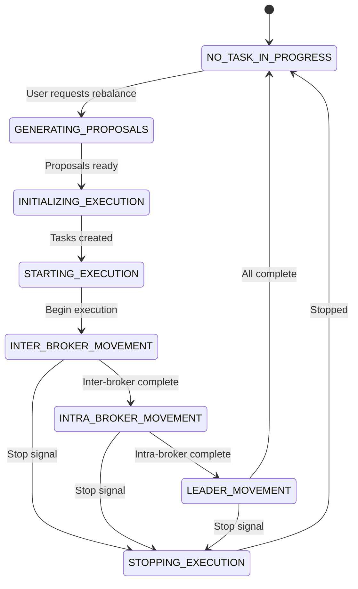

# Deep Dive: The Goal Optimizer and Execution Engine

**Part 2 of 6** in the Cruise Control Deep Dive Series

**Reading Time:** ~12 minutes
**Analysis Basis:** Commit [`e30eaf3`](https://github.com/linkedin/cruise-control/commit/e30eaf352c31511241f4dfae457fbcb77022a9c6)

## What You'll Learn

- How the 28 built-in goals work and interact
- The Template Method pattern in `AbstractGoal`
- From proposals to execution: the complete lifecycle
- The Executor's state machine and safety guarantees
- Real examples of goals optimizing a cluster

##The Goal System: Composable Constraints

Goals are the heart of Cruise Control's intelligence. Each goal represents a single optimization objective or constraint that the cluster should satisfy.

### The Goal Interface

```java
// From Goal.java
// https://github.com/linkedin/cruise-control/blob/e30eaf352c31511241f4dfae457fbcb77022a9c6/cruise-control/src/main/java/com/linkedin/kafka/cruisecontrol/analyzer/goals/Goal.java

public interface Goal extends CruiseControlConfigurable {
    /**
     * Optimize cluster model to satisfy this goal.
     * @return true if the goal was violated before optimization
     */
    boolean optimize(ClusterModel clusterModel, 
                     Set<Goal> optimizedGoals, 
                     OptimizationOptions options);
    
    /**
     * Check if a proposed action is acceptable.
     */
    ActionAcceptance actionAcceptance(BalancingAction action, 
                                      ClusterModel clusterModel);
    
    /**
     * Requirements for cluster metrics completeness.
     */
    ClusterModelCompletenessRequirements clusterModelCompletenessRequirements();
    
    String name();
}
```

**Key insight:** The `actionAcceptance()` method is how later goals respect earlier goals. When a goal considers moving a replica, it asks all previously-optimized goals if they accept the move.

### Template Method Pattern: AbstractGoal

Most goals extend `AbstractGoal`, which implements the Template Method pattern:

```java
// From AbstractGoal.java:82-135
// https://github.com/linkedin/cruise-control/blob/e30eaf352c31511241f4dfae457fbcb77022a9c6/cruise-control/src/main/java/com/linkedin/kafka/cruisecontrol/analyzer/goals/AbstractGoal.java#L82-L135

public boolean optimize(ClusterModel clusterModel, 
                        Set<Goal> optimizedGoals, 
                        OptimizationOptions options) {
    // Initialize goal-specific state
    initGoalState(clusterModel, options);
    
    // Main optimization loop
    while (!_finished) {
        // Get brokers that need balancing (hook method)
        for (Broker broker : brokersToBalance(clusterModel)) {
            // Rebalance this broker (hook method)
            rebalanceForBroker(broker, clusterModel, optimizedGoals, options);
        }
        // Update goal state (hook method)
        updateGoalState(clusterModel, excludedTopics);
    }
    
    // Finish and return whether goal was violated
    finish();
    return _violated;
}
```

**Hook methods subclasses must implement:**
- `initGoalState()` - Setup before optimization
- `brokersToBalance()` - Which brokers need work?
- `rebalanceForBroker()` - Fix this broker
- `updateGoalState()` - Check if done

### Real Example: RackAwareGoal

Let's see how `RackAwareGoal` ensures partitions are distributed across racks:

```java
// From RackAwareGoal.java
// https://github.com/linkedin/cruise-control/blob/e30eaf352c31511241f4dfae457fbcb77022a9c6/cruise-control/src/main/java/com/linkedin/kafka/cruisecontrol/analyzer/goals/RackAwareGoal.java

@Override
protected void rebalanceForBroker(Broker broker, 
                                   ClusterModel clusterModel, 
                                   Set<Goal> optimizedGoals, 
                                   OptimizationOptions options) {
    // Get partitions that violate rack awareness on this broker
    for (Replica replica : broker.replicas()) {
        if (isRackAwarenessViolated(replica, clusterModel)) {
            // Find a broker in a different rack
            List<Broker> eligibleBrokers = 
                clusterModel.aliveBrokersNotIn(replica.rack());
            
            // Try to move replica to maintain rack awareness
            for (Broker targetBroker : eligibleBrokers) {
                BalancingAction action = 
                    new BalancingAction(replica, targetBroker);
                
                // Check if previously-optimized goals accept this move
                if (optimizedGoals.stream()
                        .allMatch(g -> g.actionAcceptance(action, clusterModel)
                                        .isAcceptable())) {
                    // Perform the move in ClusterModel
                    clusterModel.relocateReplica(replica, targetBroker);
                    break;
                }
            }
        }
    }
}
```

**What's happening:**
1. Check each replica for rack-awareness violations
2. Find candidate brokers in different racks
3. For each candidate, create a proposed action
4. Ask all previous goals if they accept the action
5. If accepted, update the ClusterModel

### Goal Categories

Cruise Control's 28 goals fall into categories:

#### 1. Capacity Goals (Hard Constraints)
Ensure no broker exceeds resource limits:
- `ReplicaCapacityGoal` - Max replicas per broker
- `DiskCapacityGoal` - Max disk usage (80% default)
- `CpuCapacityGoal` - Max CPU usage (70% default)
- `NetworkInboundCapacityGoal` - Max inbound network
- `NetworkOutboundCapacityGoal` - Max outbound network

#### 2. Distribution Goals (Balance)
Spread load evenly across brokers:
- `ReplicaDistributionGoal` - Even replica count
- `DiskUsageDistributionGoal` - Even disk usage
- `CpuUsageDistributionGoal` - Even CPU usage
- `NetworkInboundUsageDistributionGoal` - Even inbound traffic
- `NetworkOutboundUsageDistributionGoal` - Even outbound traffic

#### 3. Topology Goals (Availability)
- `RackAwareGoal` - Strict rack awareness
- `RackAwareDistributionGoal` - Relaxed rack distribution
- `MinTopicLeadersPerBrokerGoal` - Leader distribution per topic

#### 4. Specialized Goals
- `PotentialNwOutGoal` - Plan for all replicas becoming leaders
- `LeaderBytesInDistributionGoal` - Distribute leader traffic
- `TopicReplicaDistributionGoal` - Per-topic distribution
- `IntraBrokerDiskCapacityGoal` - JBOD disk balancing
- `BrokerSetAwareGoal` - Multi-tenant isolation

### Goal Priority and Conflicts

Goals are executed in a specific order (from `cruisecontrol.properties`):

```
1. RackAwareGoal              ← Safety first
2. ReplicaCapacityGoal        ← Capacity limits
3. DiskCapacityGoal
4. NetworkInboundCapacityGoal
5. NetworkOutboundCapacityGoal
6. CpuCapacityGoal
7. ReplicaDistributionGoal    ← Balance objectives
8. PotentialNwOutGoal
9. DiskUsageDistributionGoal
10. NetworkInboundUsageDistributionGoal
...
```

**Why order matters:**

```java
// Scenario: ReplicaCapacityGoal says broker1 has too many replicas
// It moves replica-A to broker2

// Later, DiskUsageDistributionGoal wants to balance disk usage
// It considers moving replica-B to broker1

BalancingAction action = new BalancingAction(replicaB, broker1);

// But ReplicaCapacityGoal rejects this:
if (replicaCapacityGoal.actionAcceptance(action, clusterModel) 
        == ActionAcceptance.REJECT) {
    // Can't move to broker1 - it would violate replica capacity
}
```

Later goals must work within constraints set by earlier goals.

## From Proposals to Execution

Once goals have optimized the ClusterModel, we need to turn it into reality.

### Generating ExecutionProposals

```java
// From GoalOptimizer.java:508-513
// https://github.com/linkedin/cruise-control/blob/e30eaf352c31511241f4dfae457fbcb77022a9c6/cruise-control/src/main/java/com/linkedin/kafka/cruisecontrol/analyzer/GoalOptimizer.java#L508-L513

// Compare initial cluster state to optimized state
Set<ExecutionProposal> proposals = AnalyzerUtils.getDiff(
    initialReplicaDistribution,  // Where replicas were
    clusterModel,                 // Where they should be
    optimizationOptions);

// Returns a set of proposals:
// - INTER_BROKER_REPLICA_MOVEMENT: Move replica between brokers
// - INTRA_BROKER_REPLICA_MOVEMENT: Move replica between disks
// - LEADERSHIP_MOVEMENT: Change partition leader
```

Each proposal contains:
- `TopicPartition` - Which partition
- `ReplicasToAdd` - New broker(s) for replicas
- `ReplicasToRemove` - Old broker(s) to remove from
- `NewLeader` - New leader (if leadership change)

### Execution State Machine

The Executor is a complex state machine:



### Execution Safety Mechanisms

#### 1. Semaphore-Based Mutual Exclusion

```java
// From Executor.java:1024-1030
// https://github.com/linkedin/cruise-control/blob/e30eaf352c31511241f4dfae457fbcb77022a9c6/cruise-control/src/main/java/com/linkedin/kafka/cruisecontrol/executor/Executor.java#L1024-L1030

// Prevent multiple concurrent executions
if (!_noOngoingExecutionSemaphore.tryAcquire()) {
    throw new OngoingExecutionException("Another execution is in progress");
}

try {
    // Execution happens here
} finally {
    _noOngoingExecutionSemaphore.release();
}
```

#### 2. Task State Tracking

Every execution task has a state:

```java
public enum ExecutionTaskState {
    PENDING,        // Not started yet
    IN_PROGRESS,    // Currently executing
    ABORTING,       // Being aborted
    ABORTED,        // Successfully aborted
    DEAD,           // Failed (broker down, timeout, etc.)
    COMPLETED       // Successfully finished
}
```

The Executor monitors tasks and updates states:

```java
// From Executor.java:1843-1870
// https://github.com/linkedin/cruise-control/blob/e30eaf352c31511241f4dfae457fbcb77022a9c6/cruise-control/src/main/java/com/linkedin/kafka/cruisecontrol/executor/Executor.java#L1843-L1870

for (ExecutionTask task : inProgressTasks) {
    if (_stopSignal.get() > 0) {
        // Stop requested - mark task as dead
        markTaskDead(task);
    } else if (isTopicDeleted(task.topicPartition())) {
        // Topic was deleted - abort task
        markTaskAborted(task);
    } else if (isTaskCompleted(task)) {
        // Check if replicas are in-sync
        if (task.inProgressReplicas().isEmpty()) {
            markTaskCompleted(task);
        }
    } else if (isDestinationBrokerDead(task)) {
        // Destination broker failed - mark dead
        markTaskDead(task);
    }
}
```

#### 3. Rollback Support

For inter-broker movements, Cruise Control can rollback:

```java
// When execution is stopped mid-way
if (_stopSignal.get() > 0) {
    // Cancel ongoing reassignments via Kafka Admin API
    List<TopicPartition> toCancel = inProgressTasks.stream()
        .map(ExecutionTask::topicPartition)
        .collect(Collectors.toList());
    
    _adminClient.cancelPartitionReassignments(toCancel);
}
```

**Limitation:** Intra-broker and leadership movements can't be rolled back (they're atomic).

#### 4. Dynamic Concurrency Adjustment

The Executor can reduce concurrency if the cluster is stressed:

```java
// From Executor.java:557-562
// https://github.com/linkedin/cruise-control/blob/e30eaf352c31511241f4dfae457fbcb77022a9c6/cruise-control/src/main/java/com/linkedin/kafka/cruisecontrol/executor/Executor.java#L557-L562

// Check broker metrics during execution
for (Broker broker : clusterModel.aliveBrokers()) {
    double cpuUtil = broker.load().expectedUtilizationFor(Resource.CPU);
    
    if (cpuUtil > 0.8) {  // Broker is stressed
        // Reduce concurrency for this broker
        adjustConcurrency(broker, -1);
    }
}
```

This prevents execution from overwhelming the cluster.

## Real-World Example: Rebalancing a Cluster

Let's walk through a complete rebalance:

### Initial State

```
Broker 0 (rack-a): 150 replicas, 70% disk, 50% CPU
Broker 1 (rack-a): 100 replicas, 40% disk, 30% CPU  
Broker 2 (rack-b): 120 replicas, 55% disk, 40% CPU
Broker 3 (rack-b):  80 replicas, 30% disk, 25% CPU
```

### Goal Optimization

**RackAwareGoal:**
- ✅ All partitions have replicas in both rack-a and rack-b
- No changes needed

**ReplicaCapacityGoal:**
- ✅ All brokers under max replica limit (10,000)
- No changes needed

**Disk CapacityGoal:**
- ✅ All brokers under 80% disk threshold
- No changes needed

**CpuCapacityGoal:**
- ✅ All brokers under 70% CPU threshold
- No changes needed

**ReplicaDistributionGoal:**
- ❌ Variance too high (150 vs 80 replicas)
- **Action:** Move 20 replicas from broker-0 to broker-3
- **Action:** Move 5 replicas from broker-2 to broker-1

**DiskUsageDistributionGoal:**
- ❌ Disk variance too high (70% vs 30%)
- **Action:** Move high-disk replicas from broker-0 to broker-3

### Generated Proposals

```
ExecutionProposal 1: INTER_BROKER_REPLICA_MOVEMENT
  TopicPartition: topic-A-partition-5
  From: broker-0
  To: broker-3
  Estimated data: 1.2 GB
  
ExecutionProposal 2: INTER_BROKER_REPLICA_MOVEMENT
  TopicPartition: topic-B-partition-12
  From: broker-0
  To: broker-3
  Estimated data: 0.8 GB

... (23 more inter-broker movements)

ExecutionProposal 24: LEADERSHIP_MOVEMENT
  TopicPartition: topic-A-partition-3
  From: broker-0
  To: broker-1
  
... (10 more leadership movements)
```

### Execution Timeline

```
00:00 - Execution starts
        State: INTER_BROKER_REPLICA_MOVEMENT_TASK_IN_PROGRESS
        Active tasks: 10 (concurrency limit)
        
00:02 - First task completes (topic-A-partition-5 in-sync)
        Completed: 1, In-progress: 10, Pending: 14
        
00:05 - 5 tasks complete
        Completed: 5, In-progress: 10, Pending: 10
        
00:08 - Broker-2 CPU spikes to 85%
        Concurrency adjusted: 10 → 8 tasks
        
00:15 - All inter-broker movements complete
        State: LEADER_MOVEMENT_TASK_IN_PROGRESS
        
00:16 - Leadership movements complete (fast!)
        State: NO_TASK_IN_PROGRESS
        Execution finished
```

## Key Takeaways

1. **Goals are composable:** Each goal has one job, later goals respect earlier goals
2. **Template Method provides structure:** AbstractGoal enforces consistent optimization flow
3. **Execution is a state machine:** Clear states prevent race conditions
4. **Safety has many layers:** Semaphores, state tracking, rollback, concurrency limits
5. **Execution adapts to cluster health:** Dynamic concurrency prevents overload

## Next Steps

1. **Try implementing a custom goal:** Start with a simple distribution goal
2. **Monitor an execution:** Watch the state transitions via `/state` endpoint
3. **Experiment with concurrency:** Tune execution parameters for your cluster
4. **Next in series:** Post 3 covers design patterns used throughout Cruise Control

---

**Next Post:** [Design Patterns and Practices in Cruise Control →](./03-patterns-practices.md)

*This post is part of a 6-part series analyzing Cruise Control for Apache Kafka. All code references are based on commit [`e30eaf3`](https://github.com/linkedin/cruise-control/commit/e30eaf352c31511241f4dfae457fbcb77022a9c6).*
