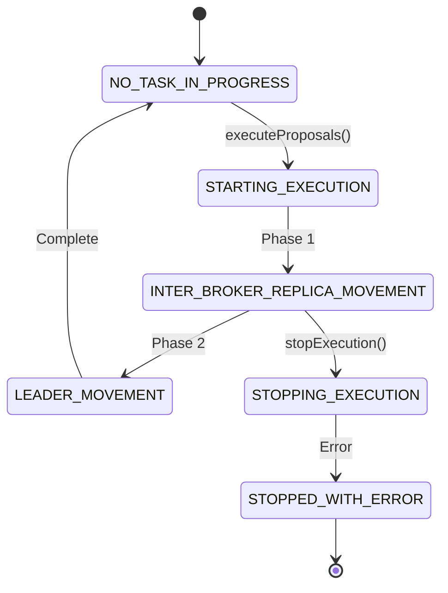

# RFC-0008: Improved Documentation and Developer Experience

**Status:** Proposed
**Created:** 2025-11-20
**Authors:** Analysis Team
**Commit Base:** [`e30eaf3`](https://github.com/linkedin/cruise-control/commit/e30eaf352c31511241f4dfae457fbcb77022a9c6)

---

## Executive Summary

Cruise Control has **30-40% Javadoc coverage** and sparse inline comments, making onboarding and contribution challenging. This RFC proposes a comprehensive documentation improvement initiative covering: API documentation, architecture guides, contribution guidelines, code examples, and interactive tutorials.

**Impact:** Improved developer experience, faster onboarding, increased community contributions
**Effort:** 10-15 developer-days (2-3 weeks)
**Risk:** Low (documentation changes are non-breaking)

---

## Problem Statement

### Current Documentation Gaps

#### 1. **Low Javadoc Coverage (30-40%)**

**Analysis of Core Classes:**

| Package | Javadoc Coverage | Issue |
|---------|-----------------|-------|
| `com.linkedin.kafka.cruisecontrol.analyzer` | ~35% | Many Goal classes undocumented |
| `com.linkedin.kafka.cruisecontrol.executor` | ~25% | Complex execution logic unexplained |
| `com.linkedin.kafka.cruisecontrol.model` | ~40% | ClusterModel internals unclear |
| `com.linkedin.kafka.cruisecontrol.monitor` | ~45% | Best documented package |
| `com.linkedin.kafka.cruisecontrol.servlet` | ~30% | API endpoints need examples |

**Example: Missing Critical Documentation**

```java
// Current: No documentation
public class Executor {
    private void maybeUpdateOngoingExecutionState() {
        // 200 lines of complex logic
        // No comments explaining the state transitions
    }
}

// Desired: Clear documentation
/**
 * Updates the state of ongoing execution based on Kafka cluster changes.
 *
 * <p>This method is called periodically (every 10 seconds) to:
 * <ol>
 *   <li>Check if in-sync replicas match expected state</li>
 *   <li>Transition tasks from PENDING → IN_PROGRESS → COMPLETED</li>
 *   <li>Detect and handle stuck executions</li>
 *   <li>Update metrics and logging</li>
 * </ol>
 *
 * <p><b>State Transitions:</b>
 * <pre>
 *   PENDING → IN_PROGRESS: When ISR contains new replica
 *   IN_PROGRESS → COMPLETED: When ISR matches target
 *   IN_PROGRESS → ABORTING: On error or timeout
 * </pre>
 *
 * @throws ExecutionException if unable to query cluster state
 */
private void maybeUpdateOngoingExecutionState() throws ExecutionException {
    // Implementation with inline comments...
}
```

#### 2. **Sparse Inline Comments**

**Current State:**
- Complex algorithms lack explanatory comments
- Non-obvious design decisions not explained
- Performance optimizations not documented

**Example: ClusterModel.java**

```java
// Current: No explanation of time complexity
private void updateReplicaLoad(Replica replica, AggregatedMetricValues metricValues) {
    for (Map.Entry<Short, MetricValues> entry : metricValues.valuesFor(resource).entrySet()) {
        // ... complex aggregation logic ...
    }
}

// Desired: Clear explanation
/**
 * Updates replica load with new metric values.
 *
 * Time Complexity: O(windows * resources) where:
 * - windows: number of time windows (typically 168 for 1 week hourly)
 * - resources: number of resource types (5: CPU, NW_IN, NW_OUT, DISK, FOLLOWER_CPU)
 *
 * Memory Impact: Each replica stores ~1.5KB per window (168 windows = ~250KB per replica)
 *
 * Performance Note: This is called during ClusterModel build, which happens every 120s.
 * For 1M partitions, this method is called 1M times = ~10s total.
 */
private void updateReplicaLoad(Replica replica, AggregatedMetricValues metricValues) {
    // ... implementation ...
}
```

#### 3. **Missing Architecture Documentation**

**Current:** README.md has basic overview, but missing:
- Data flow diagrams
- Component interaction details
- Extension points guide
- Performance characteristics
- Failure mode analysis

#### 4. **Limited Code Examples**

**Current Examples:**
- Basic REST API curl commands
- No Java client examples
- No custom goal implementation examples
- No integration examples (Prometheus, Slack, etc.)

---

## Proposed Solution

### 1. Comprehensive Javadoc Initiative

**Goal:** Achieve **80% Javadoc coverage** across all public APIs

#### 1.1 Automated Enforcement

**Gradle Configuration:**

```gradle
// build.gradle
javadoc {
    options {
        // Fail build on missing Javadoc
        addStringOption('Xwerror', '-quiet')

        // Generate detailed reports
        addStringOption('Xdoclint:all', '-Xdoclint:-missing')
    }
}

// Checkstyle rule
checkstyle {
    configFile = file("config/checkstyle/checkstyle.xml")
}
```

**checkstyle.xml:**

```xml
<module name="JavadocMethod">
    <property name="scope" value="public"/>
    <property name="validateThrows" value="true"/>
    <property name="allowMissingParamTags" value="false"/>
    <property name="allowMissingReturnTag" value="false"/>
</module>

<module name="JavadocType">
    <property name="scope" value="public"/>
    <property name="authorFormat" value="\S"/>
</module>
```

#### 1.2 Documentation Templates

**Template for Goal Classes:**

```java
/**
 * [Short one-line description of what this goal optimizes]
 *
 * <h3>Goal Behavior</h3>
 * <p>[Detailed description of optimization strategy]
 *
 * <h3>Priority</h3>
 * <p>Priority: [X] - [Explanation of when this goal should run]
 *
 * <h3>Hard vs Soft Goal</h3>
 * <p>[Hard/Soft] - [Explanation]
 *
 * <h3>Example Scenario</h3>
 * <pre>
 * Before:
 *   Broker 1: [state]
 *   Broker 2: [state]
 *
 * After:
 *   Broker 1: [state]
 *   Broker 2: [state]
 * </pre>
 *
 * <h3>Configuration</h3>
 * <ul>
 *   <li>{@code config.property.name} - Description</li>
 * </ul>
 *
 * <h3>Performance Characteristics</h3>
 * <ul>
 *   <li>Time Complexity: O([complexity])</li>
 *   <li>Typical execution time: [time] for [cluster size]</li>
 * </ul>
 *
 * @see RelatedGoal
 */
public class MyCustomGoal extends AbstractGoal {
    // ...
}
```

**Template for Complex Methods:**

```java
/**
 * [One-line summary]
 *
 * <p>[Detailed description of what the method does and why]
 *
 * <h4>Algorithm</h4>
 * <ol>
 *   <li>Step 1: [description]</li>
 *   <li>Step 2: [description]</li>
 * </ol>
 *
 * <h4>Performance</h4>
 * <ul>
 *   <li>Time Complexity: O([complexity])</li>
 *   <li>Space Complexity: O([complexity])</li>
 * </ul>
 *
 * <h4>Example</h4>
 * <pre>{@code
 * // Example usage
 * ClusterModel model = loadMonitor.clusterModel();
 * OptimizerResult result = optimizer.optimizations(model, goals);
 * }</pre>
 *
 * @param param1 description with constraints
 * @param param2 description with constraints
 * @return description with details about return value
 * @throws SpecificException when [condition]
 */
```

#### 1.3 Priority Areas for Documentation

**P0 (Week 1):**
1. All public API classes in `com.linkedin.kafka.cruisecontrol`
2. All Goal classes (`com.linkedin.kafka.cruisecontrol.analyzer.goals`)
3. Executor class and state machine
4. REST API servlet classes

**P1 (Week 2):**
1. ClusterModel and related classes
2. LoadMonitor and metrics sampling
3. AnomalyDetector and detectors
4. Configuration classes

**P2 (Week 3):**
1. Utility classes
2. Exception classes
3. Internal implementation details

---

### 2. Architecture Documentation

#### 2.1 Create `/docs` Directory Structure

```
docs/
├── architecture/
│   ├── 00-overview.md                    # High-level system overview
│   ├── 01-load-monitor.md                # LoadMonitor deep dive
│   ├── 02-goal-optimizer.md              # GoalOptimizer internals
│   ├── 03-executor.md                    # Execution engine
│   ├── 04-anomaly-detector.md            # Anomaly detection
│   ├── 05-cluster-model.md               # ClusterModel structure
│   └── diagrams/                         # Mermaid + PNG exports
│       ├── architecture-overview.mermaid
│       ├── data-flow.mermaid
│       ├── execution-state-machine.mermaid
│       └── goal-dependency-graph.mermaid
├── user-guide/
│   ├── quickstart.md
│   ├── installation.md
│   ├── configuration.md
│   ├── operation.md
│   └── troubleshooting.md
├── developer-guide/
│   ├── contributing.md
│   ├── building.md
│   ├── testing.md
│   ├── custom-goals.md
│   ├── custom-anomaly-detectors.md
│   ├── custom-samplers.md
│   └── api-reference.md
├── operations/
│   ├── deployment-kubernetes.md
│   ├── deployment-docker.md
│   ├── monitoring.md
│   ├── capacity-planning.md
│   ├── disaster-recovery.md
│   └── upgrade-guide.md
└── examples/
    ├── java-client/
    ├── custom-goal/
    ├── prometheus-integration/
    └── slack-notifications/
```

#### 2.2 Example Architecture Document

**docs/architecture/03-executor.md:**

```markdown
# Executor: Safe Execution Engine

## Overview

The Executor is responsible for safely applying optimization proposals to the Kafka cluster. It implements a state machine that carefully orchestrates partition movements and leader elections while respecting throttling limits.

## State Machine



## Execution Phases

### Phase 1: Inter-Broker Replica Movement

**Goal:** Move partition replicas between brokers

**Algorithm:**
1. Create ExecutionTask for each replica movement
2. Sort tasks by priority (leadership, broker load)
3. Submit to Kafka AdminClient in batches
4. Monitor ISR status every 10 seconds
5. Mark tasks COMPLETED when ISR matches target

**Throttling:**
- Max concurrent movements: configurable (default: 5)
- Bandwidth throttling via Kafka's inter-broker throttle

### Phase 2: Leadership Movement

**Goal:** Transfer leadership to preferred replicas

**Algorithm:**
1. Identify partitions needing leader election
2. Call AdminClient.electLeaders(PREFERRED)
3. Verify leadership changed
4. Update ClusterModel

## Error Handling

[...]

## Configuration

[...]
```

---

### 3. Interactive Examples and Tutorials

#### 3.1 Code Examples Repository

**Create: `cruise-control-examples/` repository**

```
cruise-control-examples/
├── README.md
├── java-client/
│   ├── pom.xml
│   ├── README.md
│   └── src/main/java/
│       ├── RebalanceExample.java
│       ├── ProposalReviewExample.java
│       └── MonitoringExample.java
├── custom-goal/
│   ├── pom.xml
│   ├── README.md
│   └── src/main/java/
│       └── CustomBalanceGoal.java
├── integrations/
│   ├── prometheus/
│   │   ├── docker-compose.yml
│   │   ├── prometheus.yml
│   │   └── grafana-dashboard.json
│   ├── slack/
│   │   └── SlackNotifier.java
│   └── datadog/
│       └── DatadogReporter.java
└── kubernetes/
    ├── deployment.yaml
    ├── service.yaml
    ├── configmap.yaml
    └── README.md
```

**Example: `java-client/src/main/java/RebalanceExample.java`**

```java
package com.linkedin.kafka.cruisecontrol.examples;

import java.net.http.HttpClient;
import java.net.http.HttpRequest;
import java.net.http.HttpResponse;
import java.net.URI;
import com.fasterxml.jackson.databind.JsonNode;
import com.fasterxml.jackson.databind.ObjectMapper;

/**
 * Example: Programmatic rebalance using Cruise Control REST API
 *
 * This example demonstrates:
 * 1. Requesting rebalance with specific goals
 * 2. Polling for completion
 * 3. Error handling
 */
public class RebalanceExample {
    private static final String CRUISE_CONTROL_URL = "http://localhost:9090";
    private static final HttpClient client = HttpClient.newHttpClient();
    private static final ObjectMapper mapper = new ObjectMapper();

    public static void main(String[] args) throws Exception {
        // Step 1: Request rebalance
        System.out.println("Requesting rebalance...");
        String userTaskId = requestRebalance();
        System.out.println("User task ID: " + userTaskId);

        // Step 2: Poll for completion
        while (true) {
            UserTaskState state = checkUserTask(userTaskId);
            System.out.println("Status: " + state.status());

            if (state.status().equals("Completed")) {
                System.out.println("Rebalance completed successfully!");
                System.out.println("Summary: " + state.summary());
                break;
            } else if (state.status().equals("Error")) {
                System.err.println("Rebalance failed: " + state.error());
                break;
            }

            Thread.sleep(5000); // Poll every 5 seconds
        }
    }

    private static String requestRebalance() throws Exception {
        // Build request with goals
        String goals = String.join(",",
            "RackAwareGoal",
            "ReplicaCapacityGoal",
            "DiskCapacityGoal",
            "NetworkInboundCapacityGoal",
            "NetworkOutboundCapacityGoal",
            "CpuCapacityGoal",
            "ReplicaDistributionGoal",
            "PotentialNwOutGoal",
            "DiskUsageDistributionGoal",
            "NetworkInboundUsageDistributionGoal",
            "NetworkOutboundUsageDistributionGoal",
            "CpuUsageDistributionGoal",
            "TopicReplicaDistributionGoal",
            "LeaderReplicaDistributionGoal",
            "LeaderBytesInDistributionGoal"
        );

        HttpRequest request = HttpRequest.newBuilder()
            .uri(URI.create(CRUISE_CONTROL_URL + "/rebalance?goals=" + goals
                + "&dryrun=false&verbose=true"))
            .POST(HttpRequest.BodyPublishers.noBody())
            .build();

        HttpResponse<String> response = client.send(request,
            HttpResponse.BodyHandlers.ofString());

        if (response.statusCode() != 200) {
            throw new RuntimeException("Rebalance request failed: " + response.body());
        }

        // Parse user task ID from response
        JsonNode json = mapper.readTree(response.body());
        return json.get("userTaskId").asText();
    }

    private static UserTaskState checkUserTask(String userTaskId) throws Exception {
        HttpRequest request = HttpRequest.newBuilder()
            .uri(URI.create(CRUISE_CONTROL_URL
                + "/user_tasks?user_task_ids=" + userTaskId))
            .GET()
            .build();

        HttpResponse<String> response = client.send(request,
            HttpResponse.BodyHandlers.ofString());

        JsonNode json = mapper.readTree(response.body());
        JsonNode task = json.get("userTasks").get(0);

        return new UserTaskState(
            task.get("Status").asText(),
            task.has("Summary") ? task.get("Summary").asText() : null,
            task.has("Error") ? task.get("Error").asText() : null
        );
    }

    record UserTaskState(String status, String summary, String error) {}
}
```

#### 3.2 Custom Goal Tutorial

**docs/developer-guide/custom-goals.md:**

```markdown
# Creating a Custom Goal

This tutorial walks through implementing a custom goal that balances partitions
based on a custom metric.

## Step 1: Extend AbstractGoal

```java
package com.example;

import com.linkedin.kafka.cruisecontrol.analyzer.goals.AbstractGoal;
import com.linkedin.kafka.cruisecontrol.model.ClusterModel;
import com.linkedin.kafka.cruisecontrol.model.Broker;

public class CustomBalanceGoal extends AbstractGoal {
    @Override
    public String name() {
        return "CustomBalanceGoal";
    }

    @Override
    public OptimizationResult optimize(ClusterModel clusterModel,
                                      Set<Goal> optimizedGoals,
                                      OptimizationOptions options) {
        // Your optimization logic here
    }

    @Override
    public boolean isHardGoal() {
        return false; // Make this a soft goal
    }

    // ... implement other required methods
}
```

## Step 2: Register the Goal

[...]

## Step 3: Configure Priority

[...]

## Step 4: Test Your Goal

[...]
```

---

### 4. Developer Contribution Guide

**CONTRIBUTING.md:**

```markdown
# Contributing to Cruise Control

Thank you for your interest in contributing!

## Quick Start

1. **Fork and Clone**
   ```bash
   git clone https://github.com/yourusername/cruise-control.git
   cd cruise-control
   ```

2. **Build**
   ```bash
   ./gradlew build
   ```

3. **Run Tests**
   ```bash
   ./gradlew test
   ```

## Code Style

We use Checkstyle to enforce code style. Run:
```bash
./gradlew checkstyleMain checkstyleTest
```

## Documentation Standards

### Javadoc Requirements

All public classes and methods must have Javadoc:

- **Classes:** Describe purpose, behavior, thread-safety
- **Methods:** Describe what, not how (unless complex algorithm)
- **Parameters:** Constraints and valid ranges
- **Returns:** What the return value represents
- **Throws:** When and why exceptions are thrown

### Example

```java
/**
 * Optimizes the cluster according to the specified goals.
 *
 * <p>This method runs each goal in priority order, modifying the
 * ClusterModel in-place. Goals may revert changes made by previous
 * goals if those changes violate the current goal's requirements.
 *
 * <p><b>Performance:</b> O(goals * brokers * partitions) in worst case.
 * Typical execution time is 30-60 seconds for 1000 brokers.
 *
 * @param clusterModel the cluster state to optimize (modified in-place)
 * @param goals the ordered list of goals to satisfy
 * @param options optimization options (e.g., excluded brokers)
 * @return result containing proposals and statistics
 * @throws OptimizationFailureException if goals cannot be satisfied
 */
public OptimizationResult optimize(ClusterModel clusterModel,
                                  List<Goal> goals,
                                  OptimizationOptions options)
    throws OptimizationFailureException {
    // ...
}
```

## Testing Guidelines

[...]

## Pull Request Process

[...]
```

---

### 5. API Reference Documentation

#### 5.1 Generate OpenAPI Specification

**Create: `docs/api/openapi.yaml`**

```yaml
openapi: 3.0.0
info:
  title: Cruise Control REST API
  version: 2.0.0
  description: |
    REST API for LinkedIn's Cruise Control for Apache Kafka.

    ## Authentication
    Supports JWT, Basic Auth, and SPNEGO.

    ## Rate Limiting
    Default: 10 requests per minute per client IP.

servers:
  - url: http://localhost:9090
    description: Local development server

paths:
  /rebalance:
    post:
      summary: Request cluster rebalance
      description: |
        Triggers a cluster rebalance operation using specified goals.

        **Important:** Set `dryrun=false` to actually execute.

        **Execution Time:** Typically 10-60 minutes for large clusters.
      parameters:
        - name: goals
          in: query
          description: Comma-separated list of goal names
          required: false
          schema:
            type: string
            example: "RackAwareGoal,ReplicaCapacityGoal"
        - name: dryrun
          in: query
          description: Whether to only generate proposals (true) or execute (false)
          required: false
          schema:
            type: boolean
            default: true
        - name: verbose
          in: query
          description: Include detailed proposal information
          required: false
          schema:
            type: boolean
            default: false
      responses:
        '200':
          description: Rebalance initiated successfully
          content:
            application/json:
              schema:
                $ref: '#/components/schemas/RebalanceResponse'
              example:
                userTaskId: "12345678-abcd-1234-efgh-123456789012"
                summary: "Rebalancing cluster with 15 goals"
        '429':
          description: Another operation is in progress
          content:
            application/json:
              schema:
                $ref: '#/components/schemas/ErrorResponse'
  # ... more endpoints ...

components:
  schemas:
    RebalanceResponse:
      type: object
      properties:
        userTaskId:
          type: string
          format: uuid
          description: ID to track this operation
        summary:
          type: string
          description: Human-readable summary
    # ... more schemas ...
```

#### 5.2 Generate API Documentation Site

```bash
# Use Redoc to generate beautiful API docs
npx @redocly/cli build-docs docs/api/openapi.yaml \
  --output docs/api/index.html

# Publish to GitHub Pages
# Available at: https://linkedin.github.io/cruise-control/api/
```

---

### 6. Video Tutorials and Screencasts

**Create YouTube playlist: "Cruise Control Tutorial Series"**

1. **Getting Started** (10 minutes)
   - Installation
   - First rebalance
   - Understanding proposals

2. **Deep Dive: Goals** (15 minutes)
   - How goals work
   - Goal prioritization
   - Creating custom goals

3. **Operational Best Practices** (20 minutes)
   - Monitoring
   - Capacity planning
   - Troubleshooting common issues

4. **Advanced: Anomaly Detection** (15 minutes)
   - Configuring detectors
   - Custom anomaly detectors
   - Integration with alerting systems

---

## Implementation Plan

### Week 1: Core API Documentation

- [ ] Add Javadoc to all public classes in `com.linkedin.kafka.cruisecontrol`
- [ ] Add Javadoc to all Goal classes
- [ ] Add Javadoc to Executor and state machine methods
- [ ] Enable Checkstyle Javadoc validation
- [ ] Run spotless/checkstyle and fix violations

**Deliverables:**
- 80% Javadoc coverage on public APIs
- Checkstyle passing

### Week 2: Architecture Documentation

- [ ] Create `/docs` directory structure
- [ ] Write architecture overview documents
- [ ] Create Mermaid diagrams (export to PNG)
- [ ] Write developer guide
- [ ] Write operations guide

**Deliverables:**
- Complete `/docs` directory
- 5+ architecture documents
- 5+ operational guides

### Week 3: Examples and Tooling

- [ ] Create `cruise-control-examples` repository
- [ ] Write Java client examples
- [ ] Write custom goal example
- [ ] Write integration examples (Prometheus, Slack)
- [ ] Create Kubernetes deployment examples
- [ ] Generate OpenAPI specification
- [ ] Build API documentation site

**Deliverables:**
- Working code examples (tested)
- OpenAPI spec
- API documentation site

---

## Success Metrics

| Metric | Current | Target | Measurement |
|--------|---------|--------|-------------|
| Javadoc Coverage | 30-40% | 80% | Gradle report |
| Architecture Docs | README only | 10+ documents | File count |
| Code Examples | 0 | 10+ | Example repo |
| API Documentation | curl examples | OpenAPI + site | Available URL |
| Contribution Guide | Basic | Comprehensive | CONTRIBUTING.md |
| Time to First Contribution | ~2 weeks | ~2 days | Survey new contributors |

---

## Effort Estimate

| Task | Developer-Days |
|------|----------------|
| Javadoc improvement | 5 days |
| Architecture docs | 3 days |
| Code examples | 3 days |
| API documentation | 2 days |
| Contribution guide | 1 day |
| Video tutorials (optional) | 3 days |
| **Total** | **10-15 days** |

---

## Priority

**Priority:** P2 (Important but not urgent)
**Impact:** High (improves adoption and contribution)
**Effort:** Low-Medium (10-15 days)
**Dependencies:** None

**Recommendation:** Start during low-activity periods (e.g., after major release)

---

## Alternatives Considered

### Alternative 1: Third-Party Documentation Service

**Examples:** ReadTheDocs, GitBook

**Pros:**
- Beautiful formatting
- Search functionality
- Version management

**Cons:**
- Additional service dependency
- Learning curve
- Markdown in repo + external service = duplication

**Decision:** Use GitHub Pages for simplicity

### Alternative 2: Wiki-Based Documentation

**Pros:**
- Easy to edit
- No build process

**Cons:**
- Not version controlled with code
- Lower quality (no review process)
- Can become stale

**Decision:** Keep docs in repo for version control

---

## References

- [Google Java Style Guide](https://google.github.io/styleguide/javaguide.html)
- [Oracle Javadoc Guidelines](https://www.oracle.com/technical-resources/articles/java/javadoc-tool.html)
- [OpenAPI Specification](https://swagger.io/specification/)
- [Write the Docs](https://www.writethedocs.org/)

---

**Priority:** P2
**Effort:** 10-15 dev-days
**Dependencies:** None
**Breaking Changes:** None
